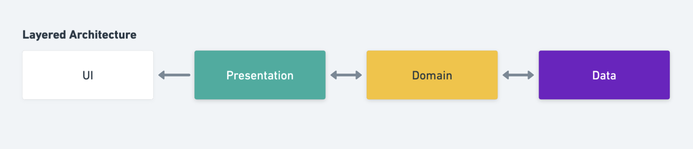
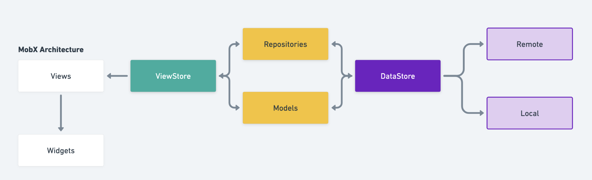

# Flutter Architecture Examples

A collection of opinionated project architectures for Flutter apps.

## Overview

Layered Architecture



## Examples

###  MobX Architecture
**Overview**



**Project Structure**
```
core
└── data
    ├── api
    ├── models
    ├── local
    └── remote
├── domain
├── widgets (common components)
└── repositories
feature
├── presentation
├── views
└── widgets
```

**See [MobX + REST example](https://github.com/joshuadeguzman/flutter-architecture-examples/tree/main/mobx) or [MobX + GraphQL example](https://github.com/joshuadeguzman/flutter-architecture-examples/tree/main/mobx_graphql).**